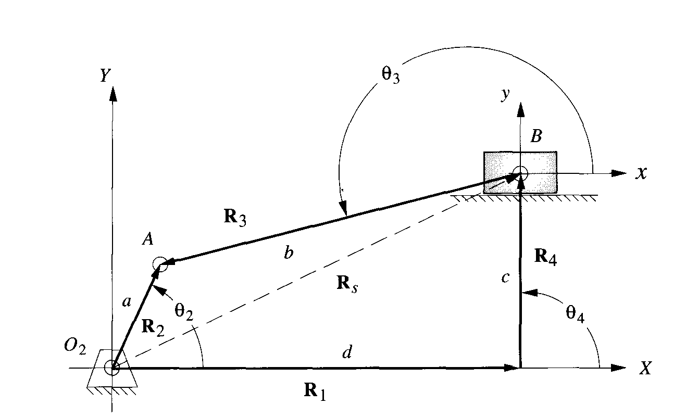
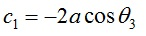

### **Introduction**

The slider-crank mechanism is one of the most useful mechanisms in modern technology since it appears in most of the internal combustion engines including automobiles, trucks and small engines. The slider-crank kinematic chain consists of four bodies linked with three cylindrical joints and one sliding or prismatic joint. It is used to change circular into reciprocating motion, or reciprocating into circular motion.

Figure 1: Slider Crank

### **Postion Analysis**

Figure 2: Slider Crank system with offset
Above figure shows a slider-crank mechanism in which the stroke-line of the slider doesn't pass through the axis of rotation of the crank. Finding the equations for this case and substituting c=0 (that is setting link length of R4 to 0) will give us the equations for slider crank mechanism without offset. The equations for the general condition as given below.

and

Where   and 